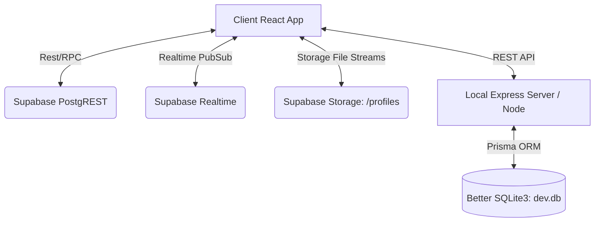

# 🧡 Baan 7 Main Portal (Very Ween 2026)

> **Creative North Star: "The Playful Orientation Guide"**
> A modern, warm, and highly interactive freshman orientation guide portal and community engagement platform for **Baan 7**. It replaces clinical corporate layouts with an organic, tactile digital space that helps minimize freshman anxiety, ignite community excitement, and streamline administrative coordination.

[](https://vite.dev)
[](https://react.dev)
[](https://chakra-ui.com)
[](https://supabase.com)
[](https://prisma.io)
[](https://baan7-orientation-portal.vercel.app)

---

## 🚀 Quick Start (Running in < 5 Min)

### 1. Prerequisites

- **Node.js** v18+ or v20+
- **NPM** v9+

### 2. Environment Configuration

Create a `.env.local` file in the root directory (using `.env.example` as a template):

```env
# Supabase Configuration
VITE_SUPABASE_URL=https://gyabqyvdxdtoaqayfjho.supabase.co
VITE_SUPABASE_ANON_KEY=your_supabase_anon_key

# Photo Gallery Server Configuration (Immich Integration)
VITE_IMMICH_URL=https://your-immich-instance.com
```

### 3. Local Installation & Development

Install all project dependencies and boot both the frontend and local server:

```bash
# Install packages
npm install

# Run Vite frontend (Port 5173) and Nodemon local Express server (Port 5001) concurrently
npm run dev:all
```

Alternatively, run them in separate terminals:

```bash
# Terminal A: Frontend only
npm run dev

# Terminal B: Express server only
npm run dev:server
```

---

## 🛠️ Technology Stack & Architecture



### Frontend Architecture

- **Core Framework:** React 19, TypeScript, Vite.
- **UI & Theme System:** Chakra UI v3 custom design tokens. No Tailwind CSS or default framework templates are used.
- **Animations:** Framer Motion for micro-interactions (fully supports `@media (prefers-reduced-motion: reduce)` with crossfade or instant transition fallback rules).
- **Icons:** Material Symbols Outlined.

### Database & Backend Services

- **Global DB & Sync:** Supabase PostgreSQL with real-time websocket channels (used for posts feed, emergency broadcasts, and swipe evaluations).
- **File Storage:** Supabase Storage (public bucket: `profiles` for profile pictures and custom photo crop uploads).
- **Local Dev Server:** Node.js Express server utilizing Nodemon, Prisma ORM, and Better SQLite3 (`dev.db`).

---

## ✨ Core Features & Modules

### 1. Vibe Check (Swipe Collection Game)

- **Tinder-Style Swipe Deck:** Freshmen swipe through a randomized deck of Baan 7 staff profiles. Swiping right initiates a `COLLECT`, while swiping left executes a `SKIP`.
- **Active Quest Banner:** Displays current goals (e.g. _Quest: Collect 3 recreation staff members_). Shows progress tracking in real time.
- **Secure Server-Side Mechanics:** Client payloads omit `role` or `major` properties. All swipe logic (calculating correct skips, inserting collections, tracking strike counts, and logging lockout times) runs on the database server via the `swipe_card_secure` RPC function to block client-side inspection.
- **Lockout Penalty Cooldown:** If a user makes 5 incorrect swipes (strikes), they are locked out of swiping. The lock duration escalates exponentially: `base_cooldown * (2 ^ lock_count)` minutes, capped at 30 minutes, rendered under a blurred glassmorphic overlay.
- **Sticker Collection Album:** A sliding bottom sheet showing a grid of all staff members. Uncollected staff render as gray silhouettes; collected ones reveal full colors, nickname, details, and Instagram links.

### 2. Live Hype & Memory Boards

- **Unified Real-time Feed:** Real-time messages, updates, and photos grouped by Board Type (`hype` or `memory`).
- **Required Tag Pills:** Composer enforces selecting tags (e.g. `#Ween2026`, `#Hype`) before posts are enabled. Includes an anonymous option.
- **Comment Sections:** Post cards support expandable comments with real-time sync. Staff posts/comments display a dedicated orange/brown prefix badge to indicate verified student status.

### 3. Profile Management System

- **Dynamic Setup & Edit (/profile-edit):** Interactive onboard setup forcing users to configure their nickname and faculty before navigating to other features.
- **Tactile Color Picking:** Direct circular accent color triggers.
- **Avatar Cropper Canvas:** Direct file and URL uploads supporting dragging, scaling, and viewport cropping. Uploads are streamed directly into Supabase Storage.

### 4. Admin & Moderator Command Center

- **CSV Student Whitelisting:** Multi-row whitelisting with Papaparse client-side file uploading. Includes validation checks, duplicate cross-checks, and preview drawers before batch upserting.
- **Game & Penalty Editor:** Interactive forms to customize game parameters (max strikes, base cooldown, max cooldown, and active vibe missions).
- **Emergency Broadcast Console:** Panel to set and update the global `emergency_announcement` in `system_config`. Turning this switch on pushes a real-time WebSocket state change that renders a flashing amber scrolling ticker at the top header of `Navbar.tsx` for all online users.
- **Real-time Administrative Audit Logs:** A chronological timeline of all admin actions (e.g., updates, whitelists, configurations) to ensure system security.
- **Staff Command Panel (/staff):** Dedicated command console for general staff members to moderate posts/comments (using secure RPC handlers) and view Baan statistics.

---

## 🎨 Design System: "Playful Orientation"

Rooted in a warm, welcoming, and high-contrast color scheme, our design system balances academic history with student community vibes.

### Color Palette (OKLCH Native Tokens)

- **Warm Ivory (`--c-ivory` / `#fcf9f8`):** The primary canvas background color, reducing eye strain relative to solid white.
- **Pure White (`--c-white` / `#ffffff`):** Reserved strictly for card overlays and container divisions on the Ivory canvas (Tonal Layering).
- **Chocolate Fondant (`--c-chocolate` / `#7c563f`):** Used for primary buttons, headings, and high-impact actions.
- **Blue Lagoon (`--c-lagoon` / `#496268`):** Primary accent color, used for secondary actions, interactive focus rings, and soft featured glows (e.g. `box-shadow: 0 12px 40px rgba(73, 98, 104, 0.15)`).
- **Charcoal Ink (`--c-ink` / `#1b1c1c`):** High-contrast body text.

### Key Rules

> [!IMPORTANT]
> **The Accent Rarity Rule:** Keep Blue Lagoon highlights restrained (≤15% of screen area). Chocolate Fondant represents primary focus points.
>
> **The Shadow & Border Ban:** Never mix solid 1px borders with soft shadows greater than 8px blur, except when applying the custom `Lagoon Halo Glow` style.
>
> **Corner Radii:** Cards, buttons, and input elements default to soft `2xl` corners (16px to 24px) for a modern, tactile feel.
>
> **Line Length:** Body text is capped at `65-75ch` maximum line width to optimize scanning readability.

---

## 🗄️ Database Schema & Security Models

```sql
-- Core Table Structures

-- Event Configurations
CREATE TABLE event_config (
    key VARCHAR PRIMARY KEY,
    title VARCHAR NOT NULL,
    event_time TIMESTAMPTZ NOT NULL
);

-- Users & Roles whitelists
CREATE TABLE users (
    student_id VARCHAR PRIMARY KEY,
    pin_hash VARCHAR, -- Client-side SHA-256 hashed 6-digit PIN
    nickname VARCHAR,
    faculty VARCHAR,
    major VARCHAR,
    ig VARCHAR,
    role VARCHAR DEFAULT 'student' CHECK (role IN ('superadmin', 'media_admin', 'staff', 'student')),
    avatar_color VARCHAR DEFAULT '#496268',
    images TEXT[] DEFAULT '{}',
    tags TEXT[] DEFAULT '{}',
    bio TEXT,
    profile_pic_url TEXT,
    photo_pool TEXT[] DEFAULT '{}'::text[],
    created_at TIMESTAMPTZ DEFAULT NOW()
);

-- Board Posts
CREATE TABLE posts (
    id BIGSERIAL PRIMARY KEY,
    content TEXT NOT NULL,
    likes INTEGER DEFAULT 0,
    liked_by TEXT[] DEFAULT '{}'::text[],
    type VARCHAR NOT NULL DEFAULT 'hype' CHECK (type IN ('hype', 'memory')),
    is_anonymous BOOLEAN DEFAULT false,
    is_hidden BOOLEAN DEFAULT false,
    student_id VARCHAR REFERENCES users(student_id) ON DELETE CASCADE,
    tags TEXT[] DEFAULT '{}'::text[],
    created_at TIMESTAMPTZ DEFAULT NOW()
);

-- Vibe Check Missions & Progress Tracking
CREATE TABLE vibe_missions (
    id BIGSERIAL PRIMARY KEY,
    sequence_order INTEGER UNIQUE NOT NULL,
    target_role VARCHAR NOT NULL,
    required_count INTEGER NOT NULL,
    created_at TIMESTAMPTZ DEFAULT NOW()
);

CREATE TABLE user_vibe_status (
    student_id VARCHAR PRIMARY KEY REFERENCES users(student_id) ON DELETE CASCADE,
    current_mission_id BIGINT REFERENCES vibe_missions(id) ON DELETE SET NULL,
    strike_count INTEGER DEFAULT 0,
    lock_count INTEGER DEFAULT 0,
    locked_until TIMESTAMPTZ DEFAULT NULL
);

CREATE TABLE collected_cards (
    id BIGSERIAL PRIMARY KEY,
    student_id VARCHAR REFERENCES users(student_id) ON DELETE CASCADE,
    staff_id VARCHAR REFERENCES users(student_id) ON DELETE CASCADE,
    collected_at TIMESTAMPTZ DEFAULT NOW(),
    CONSTRAINT unique_student_staff UNIQUE (student_id, staff_id)
);
```

### Security Definer Functions (RPC Database Triggers)

Because the portal uses a custom PIN-based authentication model querying Supabase via the `anon` key, Row Level Security (RLS) is supplemented with database functions executing under `SECURITY DEFINER`. These verify session hashes directly in Postgres before performing modifications:

1. **`swipe_card_secure(p_student_id, p_staff_id, p_direction, p_pin_hash)`**
   - Validates student ID and PIN.
   - Enforces the cooldown clock and handles the game loop.
   - Updates target quest metrics and unlocks next sequential mission ID.
2. **`delete_post_secure(p_post_id, p_student_id, p_pin_hash)`**
   - Permits post deletion only if the requester is the post creator OR holds a role of `superadmin`, `media_admin`, or `staff`.
3. **`delete_comment_secure(p_comment_id, p_student_id, p_pin_hash)`**
   - Securely checks comment authorship or staff role privileges.
4. **`broadcast_emergency_message(p_session_token, p_active, p_text)`**
   - Verifies administrative session tokens before broadcasting global config warnings.

---

## 📂 Project Directory Structure

```plaintext
ween2026/
├── .agents/                 # AG Kit AI agent workflows, conventions, and memory index
├── prisma/                  # Prisma configuration schema for Better SQLite3
├── server/                  # Node.js/Express server (handles local APIs and developer mocks)
│   └── index.js             # Express backend router
├── supabase/                # Supabase configuration & migrations
│   └── migrations/          # Chronological database schema migration files
├── src/                     # Frontend React Source
│   ├── components/          # Reusable React components
│   │   ├── ui/              # Primitive layout elements (Toaster, Provider, Tooltip)
│   │   ├── Navbar.tsx       # Dynamic desktop menu & mobile navigation dock
│   │   └── ThreeBlob.tsx    # 3D fluid backdrop animation (React Three Fiber)
│   ├── context/             # Global states (e.g., UserContext login contexts)
│   ├── hooks/               # Core subscriptions (e.g., useBoardRealtime.ts)
│   ├── pages/               # Routed view panels
│   │   ├── AdminDashboardPage.tsx  # Admin/Moderator whitelist, config, and audit trail
│   │   ├── BoardPage.tsx           # Hype & Memory real-time comment walls
│   │   ├── GalleryPage.tsx         # Media showcase (Immich proxy fallback)
│   │   ├── HomePage.tsx            # Desktop landing portal & mobile onboarding guide
│   │   ├── LoginPage.tsx           # PIN Auth submission route
│   │   ├── ProfileEditPage.tsx     # Crop & color profile builder
│   │   ├── StaffDashboardPage.tsx  # General staff control suite
│   │   └── VibeCheckPage.tsx       # Swipe collection viewport & sticker album
│   ├── theme/               # Custom design system tokens for Chakra UI
│   ├── index.css            # Global custom styles (font-faces, variables, keyframes)
│   └── main.tsx             # React DOM mounting entry point
├── PRODUCT.md               # User personas, goals, and brand voice guidelines
├── DESIGN.md                # Interactive Design Tokens definitions
└── supabase_schema.sql      # Single-file database backup script
```

---

## 📈 Quality Assurance & CI Scripts

The codebase is continuously validated using AG Kit validation scripts:

```bash
# 1. Run P0 Linting and TypeScript checks
npm run lint && npm run typecheck

# 2. Execute security scanning to identify secrets leaks or vulnerabilities
python .agents/skills/vulnerability-scanner/scripts/security_scan.py .

# 3. Perform design compliance audits for accessibility (contrast / layouts)
python .agents/skills/frontend-design/scripts/ux_audit.py .

# 4. Verify bundle optimization
npm run build
```

---

## 🔗 Infrastructure & Deployments

- **Production URL:** [https://baan7-orientation-portal.vercel.app](https://baan7-orientation-portal.vercel.app)
- **GitHub Repository:** [https://github.com/billyb1ll/ween2026.git](https://github.com/billyb1ll/ween2026.git)
- **Vercel Project ID:** `baan7-orientation-portal`
- **Supabase Host Region:** `ap-southeast-1` (Singapore)

---

## 📄 License

This project is private and proprietary to **Baan 7 (Ween 2026)**. Unauthorized redistribution or modification is strictly prohibited.
